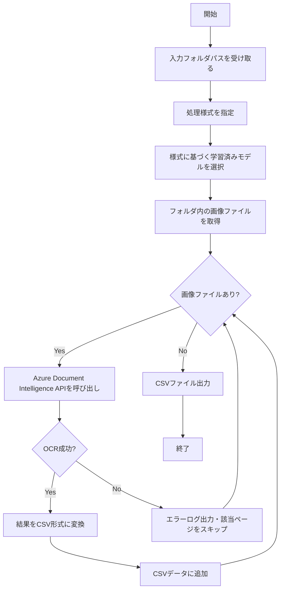

# SOL-260 Azure Document IntelligenceによるOCR処理システム - 設計書
作成日: 2025-06-28
作成者: Developer Agent
Linear: https://linear.app/team/issue/SOL-260

## 1. 概要
### 1.1 目的
AzureのAPIで画像から処理された文字起こしデータがExcelで操作できるようになっていること

### 1.2 スコープ
影響範囲: その他（現時点では特に稼働中のシステムは無い）

## 2. 機能仕様
### 2.1 入出力定義
**入力仕様:**
- 画像データが複数入っているフォルダ（のパス）
- 処理する様式の指定（複数の様式に対応）

**出力仕様:**
- CSVファイル
- 列構成：ファイル名、ページ番号、OCR結果の各項目
- 形式：1行1ページ

### 2.2 処理フロー


## 3. エラーハンドリング
| エラーケース | 対処方法 | 備考 |
|------------|---------|------|
| OCR処理失敗 | エラーが起きたページがわかるようログ出力してスキップ | ページ番号とファイル名を記録 |
| API接続エラー | リトライ後、失敗時はログ出力してスキップ | 最大3回リトライ |
| 画像ファイル読み込みエラー | ログ出力してスキップ | 破損ファイルや非対応形式 |
| モデル選択エラー | エラーメッセージを表示して処理中止 | 指定様式が未定義の場合 |

## 4. 非機能要件
### 4.1 パフォーマンス
- 特別な要件なし
- バッチ処理による効率化を検討

### 4.2 セキュリティ
- 特別な要件なし
- APIキーは環境変数で管理

## 5. システム構成
### 5.1 依存関係
- 外部API: Azure Document Intelligence Custom Extract
- 実行環境: Windows環境で動作
- Pythonライブラリ（推奨）:
  - azure-ai-formrecognizer
  - pandas (CSV操作用)
  - python-dotenv (環境変数管理)

### 5.2 データモデル
新規データモデルの作成は不要

## 6. 実装計画
### 6.1 アーキテクチャ選定
- 言語: Python 3.x
- 主要ライブラリ:
  - Azure SDK for Python
  - pandas for CSV handling
  - logging for error handling
  - pytest for TDD
- 設計パターン: バッチ処理パターン
- テスト手法: t-wadaのTDD（テスト駆動開発）

### 6.2 実装フェーズ
全フェーズを1日で完了:
1. TDDサイクル1: 基本的なOCR処理（2時間）
   - テスト作成 → Azure API接続実装 → リファクタリング
2. TDDサイクル2: 複数様式対応（2時間）
   - テスト作成 → モデル切り替え実装 → リファクタリング
3. TDDサイクル3: エラーハンドリング（2時間）
   - テスト作成 → エラー処理実装 → リファクタリング
4. TDDサイクル4: バッチ処理と出力（2時間）
   - テスト作成 → CSV出力実装 → リファクタリング

## 7. テスト計画（t-wadaのTDD手法）
### 7.1 TDDサイクル
**Red → Green → Refactorのサイクルを厳守**

#### サイクル1: 基本的なOCR処理
```python
# test_ocr_processor.py
def test_単一画像ファイルのOCR処理が成功すること():
    # Arrange
    processor = OCRProcessor(endpoint, api_key)
    # Act
    result = processor.process_single_image("test.jpg", "様式A")
    # Assert
    assert result is not None
    assert "text" in result
```

#### サイクル2: 複数様式対応
```python
def test_指定された様式に応じて適切なモデルが選択されること():
    # Arrange
    processor = OCRProcessor(endpoint, api_key)
    # Act & Assert
    assert processor.get_model_id("様式A") == "model_id_a"
    assert processor.get_model_id("様式B") == "model_id_b"
```

#### サイクル3: エラーハンドリング
```python
def test_OCR処理失敗時にエラーログが出力されスキップされること():
    # Arrange
    processor = OCRProcessor(endpoint, api_key)
    # Act
    result = processor.process_single_image("broken.jpg", "様式A")
    # Assert
    assert result is None
    assert "Error processing broken.jpg" in captured_logs
```

#### サイクル4: バッチ処理と出力
```python
def test_フォルダ内の全画像がCSVに出力されること():
    # Arrange
    processor = OCRProcessor(endpoint, api_key)
    # Act
    df = processor.process_folder("./images", "様式A")
    # Assert
    assert len(df) == expected_image_count
    assert list(df.columns) == ["filename", "page", "ocr_result"]
```

### 7.2 テスト駆動開発の原則
1. **テストファースト**: 実装前に必ずテストを書く
2. **最小限の実装**: テストを通すための最小限のコードのみ書く
3. **継続的リファクタリング**: テストが通ったら即座にリファクタリング
4. **三角測量**: 複数のテストケースで実装を導く

## 8. リスクと対策
### 8.1 技術的リスク
- 複数の別の様式があり、処理の際にどの様式を処理するのか指定する必要がある
- 指定された様式に基づき利用する学習済みモデルが変わる

### 8.2 対策
- 様式定義ファイル（config.json）による管理
- モデルIDと様式のマッピングテーブル作成
- 様式選択UIまたはコマンドライン引数での指定機能

## 9. 参考資料
- Azure Document Intelligence Documentation: https://docs.microsoft.com/azure/cognitive-services/form-recognizer/
- Azure SDK for Python: https://docs.microsoft.com/python/api/azure-ai-formrecognizer/

## 10. 実装例（概要）
```python
# main.py
import os
from azure.ai.formrecognizer import DocumentAnalysisClient
from azure.core.credentials import AzureKeyCredential
import pandas as pd
import logging

class OCRProcessor:
    def __init__(self, endpoint, api_key):
        self.client = DocumentAnalysisClient(
            endpoint=endpoint,
            credential=AzureKeyCredential(api_key)
        )
        self.model_mapping = {
            "様式A": "model_id_a",
            "様式B": "model_id_b",
            # 追加の様式
        }
    
    def process_folder(self, folder_path, form_type):
        results = []
        model_id = self.model_mapping.get(form_type)
        
        for filename in os.listdir(folder_path):
            if filename.lower().endswith(('.png', '.jpg', '.jpeg', '.pdf')):
                try:
                    result = self.process_file(
                        os.path.join(folder_path, filename),
                        model_id
                    )
                    results.extend(result)
                except Exception as e:
                    logging.error(f"Error processing {filename}: {str(e)}")
                    
        return pd.DataFrame(results)
```